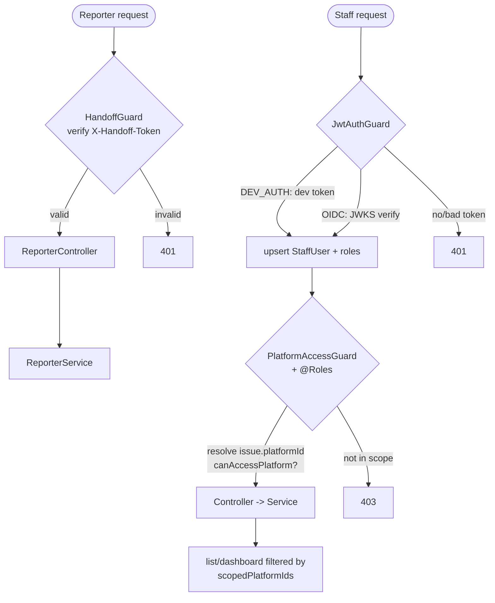
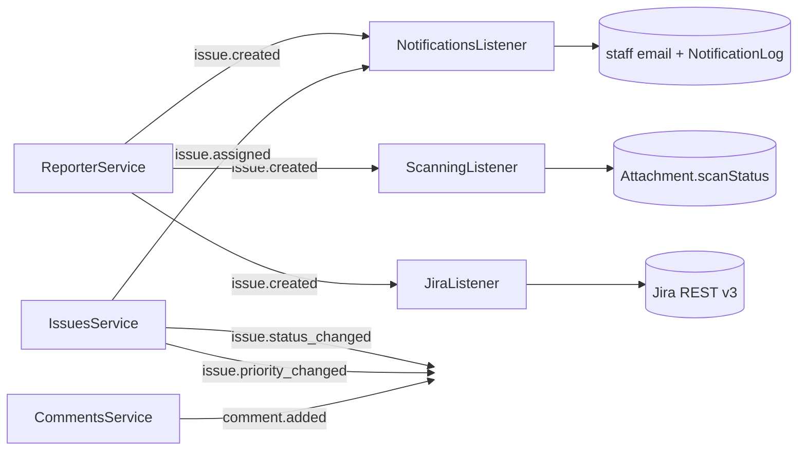
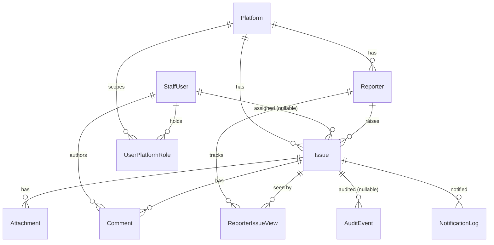
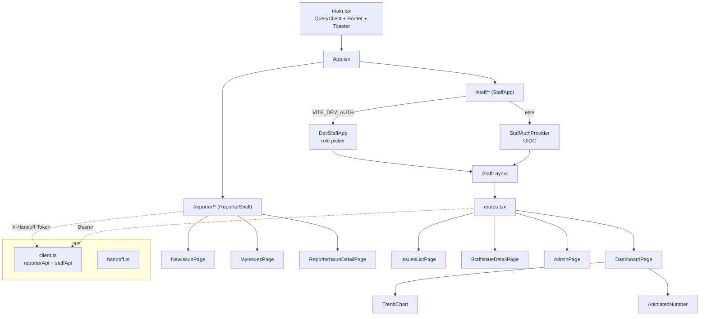

# Architecture Map

A navigation map of the codebase: module graph, request/auth flow, domain
events, data model, and the frontend. Diagrams are [Mermaid](https://mermaid.js.org/)
— they render in VS Code's Markdown preview and on GitHub.

> Generated by hand from the source (module imports, `@OnEvent`/`emit` wiring,
> entity relations). It is not the output of `/code-review` — that command reviews
> a git diff for bugs and does not produce diagrams.

---

## 1. Backend module graph

How the NestJS modules wire together. **Global** modules (Storage, Scanning,
Audit) are injectable everywhere without being imported. Feature modules depend
on `AuthModule` (authN) and `AuthzModule` (authZ).

```mermaid
flowchart TD
  App[AppModule]

  subgraph Global["Global / cross-cutting"]
    Config[ConfigModule]
    TypeOrm[(TypeOrmModule\nPostgres)]
    Throttle[ThrottlerModule]
    Events[EventEmitterModule]
    Storage[StorageModule\nlocal | S3]
    Scanning[ScanningModule\nScanService]
    Audit[AuditModule\nAuditService]
  end

  subgraph Auth["Auth backbone"]
    AuthM[AuthModule\nOIDC + DevAuth + JwtAuthGuard]
    Authz[AuthzModule\nScopeService + guards]
  end

  subgraph Features["Feature modules"]
    Handoff[HandoffModule]
    Reporter[ReporterModule]
    Issues[IssuesModule]
    Comments[CommentsModule]
    Dashboard[DashboardModule]
    Admin[AdminModule]
    Notif[NotificationsModule]
    Jira[JiraModule]
  end

  App --> Global & Auth & Features

  Reporter --> Handoff
  Issues --> AuthM & Authz
  Comments --> AuthM & Authz
  Dashboard --> AuthM & Authz
  Admin --> AuthM & Authz

  Reporter -. uses .-> Storage
  Reporter -. uses .-> Scanning
  Issues -. uses .-> Audit
  Comments -. uses .-> Audit
  Admin -. uses .-> Audit
```

| Module | Owns | Guard(s) |
|---|---|---|
| `HandoffModule` | token verify, `@Handoff()` | `HandoffGuard` |
| `ReporterModule` | intake, my-issues | `HandoffGuard` |
| `AuthModule` | OIDC + dev login, `/staff/me` | `JwtAuthGuard` |
| `AuthzModule` | `ScopeService`, role/scope checks | `PlatformAccessGuard`, `RolesGuard` |
| `IssuesModule` | list/detail/status/assign/priority, CSV, attachment download | Jwt + PlatformAccess |
| `CommentsModule` | add/edit comments | Jwt + PlatformAccess |
| `DashboardModule` | scoped metrics + trend | Jwt + PlatformAccess |
| `AdminModule` | platforms, roles, secret rotation | Jwt + Roles(ADMIN) |
| `NotificationsModule` | staff email (event-driven) | — listener |
| `JiraModule` | one-way push (event-driven) | — listener |
| `ScanningModule` | attachment scan seam | — listener |

---

## 2. Request & authorization flow

Two independent auth paths. Reporters never log in (signed portal token); staff
use OIDC (or the dev shim), then every issue-scoped route resolves the issue's
platform and checks role + scope.



Authorization core lives in [scope.service.ts](src/authz/scope.service.ts):
`scopedPlatformIds(staff)` → `'ALL' | string[]`, and
`canAccessPlatform(staff, platformId, roles)`.

---

## 3. Domain events

State changes emit events; notifications, scanning, and Jira sync are decoupled
listeners (defined in [issue-events.ts](src/events/issue-events.ts)).



| Event | Emitted by | Consumed by |
|---|---|---|
| `issue.created` | ReporterService | Notifications (focal points), Scanning, Jira |
| `issue.assigned` | IssuesService | Notifications (assignee) |
| `issue.status_changed` | IssuesService | (audit only, reserved) |
| `issue.priority_changed` | IssuesService | (audit only, reserved) |
| `comment.added` | CommentsService | (audit only, reserved) |

---

## 4. Data model

Ten entities ([src/entities/](src/entities/)). `platform = NULL` on
`UserPlatformRole` means global scope.



Key invariants: `Issue.referenceNo` unique; `Issue.version` (optimistic lock →
409); `Reporter` unique on `(platform, portalUserId)`; `UserPlatformRole` unique
on `(staffUser, role, platform)`.

---

## 5. Frontend map

Vite + React + TS, shadcn/ui, TanStack Query/Table, GSAP. Two surfaces under
[frontend/src/](frontend/src/).



---

## 6. Route → handler reference

| Method | Route | Controller |
|---|---|---|
| POST/GET | `/api/reporter/issues[/:id][/seen]` | [reporter.controller.ts](src/reporter/reporter.controller.ts) |
| GET | `/api/staff/me` | [staff.controller.ts](src/auth/staff.controller.ts) |
| GET/PATCH | `/api/staff/issues…` (`/export`, `/:id`, `/status`, `/assignment`, `/priority`) | [issues.controller.ts](src/issues/issues.controller.ts) |
| GET | `/api/staff/attachments/:id/download` | [attachments.controller.ts](src/issues/attachments.controller.ts) |
| POST/PATCH | `/api/staff/issues/:id/comments`, `/api/staff/comments/:id` | [comments.controller.ts](src/comments/comments.controller.ts) |
| GET | `/api/staff/dashboard` | [dashboard.controller.ts](src/dashboard/dashboard.controller.ts) |
| GET/POST/PATCH/DELETE | `/api/admin/platforms…`, `/api/admin/staff`, `/api/admin/roles…` | [admin.controller.ts](src/admin/admin.controller.ts) |
| GET/POST | `/api/auth/dev/users`, `/api/auth/dev/login` (dev only) | [dev-auth.controller.ts](src/auth/dev-auth.controller.ts) |
| GET | `/api/docs` (Swagger) | — |
```
